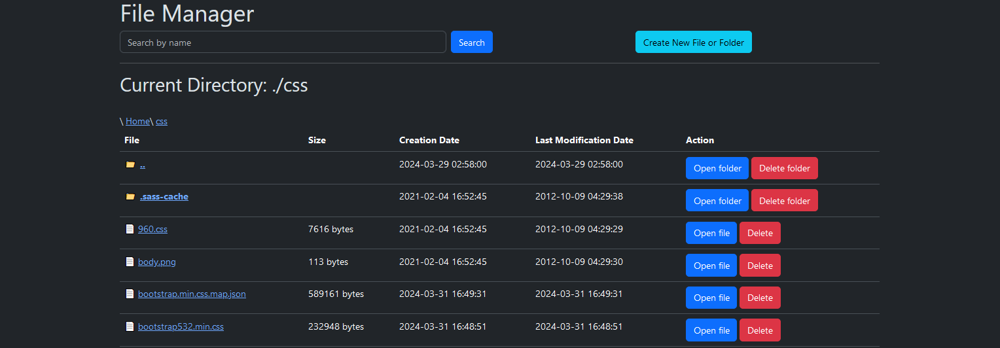
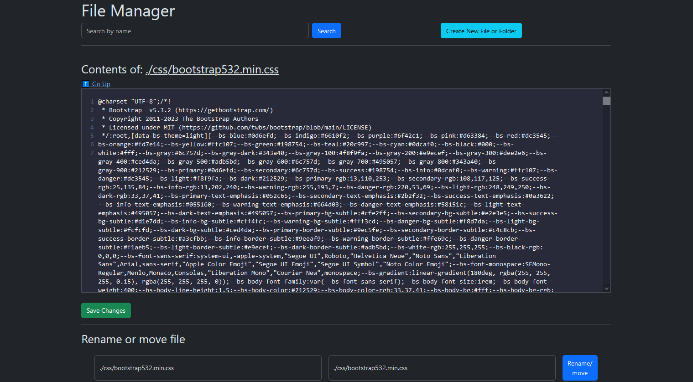
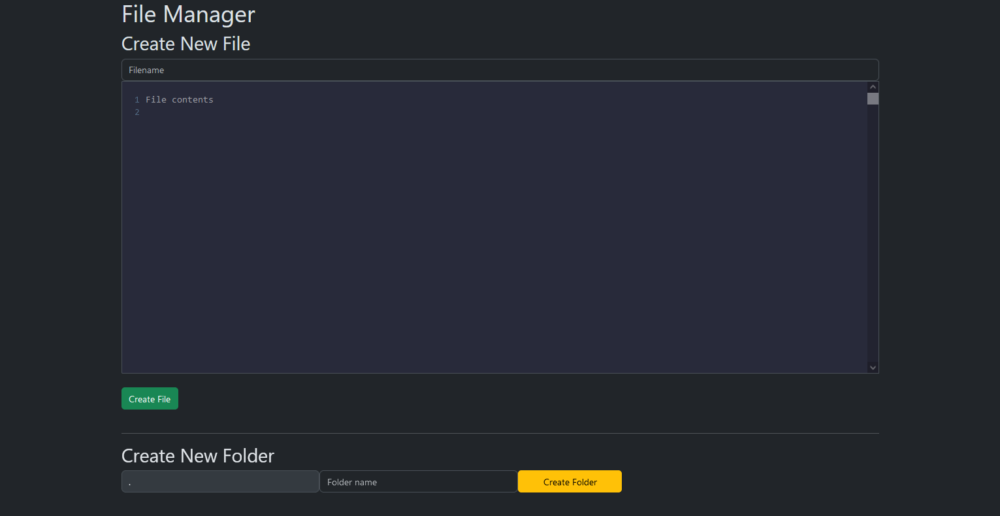

# filemanager
FileManager Simplest All-in-one (using PHP with CQRS)


**Installation and customization**

To install this file manager, you need to place it in any directory. 
> **Note:** there are no access protection settings in this file, and all folders and files will be displayed publicly, so if you need to isolate access to a file, you will need to configure access to this file yourself on your web server.

```
// Connect a file with authentication logic before accessing the web file manager, e.g. 
require_once('auth.php');
```

## Screenshots:







--- 
📫 How to search me: prologos@mail.ru 


